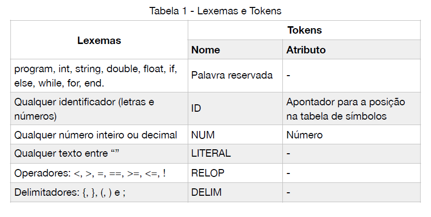
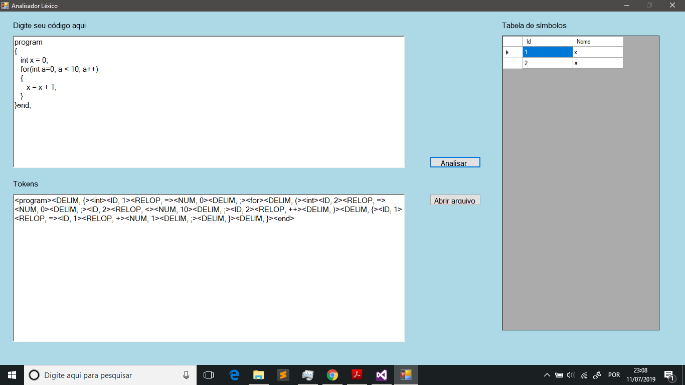

# Analisador léxico em C#

  Trabalho proposto na disciplina de Compiladores(7º Período) do curso de Ciência da Computação pelo professor Maurício, onde foi solicitado o desenvolvimento de um analisador léxico simples que identifique lexemas e retorne seus respectivos toquens. 
  
  O processo de análise léxica de um compilador consiste na leitura de um fluxo de caracteres(código fonte de um programa), e agrupamento destes em lexemas para, por fim, produzir um conjunto de tokens(um nome e um atributo opcional) para que o analisador sintático possa processar esse fluxo de caracteres de acordo com a gramática da linguagem em questão. 
  
  O projeto obedece aos requisitos expostos nas capturas de tela. Como condição de parada, utiliza-se o lexema **"end"**. Um exemplo de sintaxe de programa fonte é exibido nas capturas de tela.
  
##### Colaboradores: Willian Pereira Mariano 

#### Capturas de tela:

